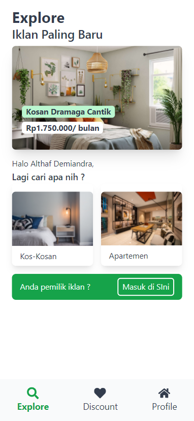
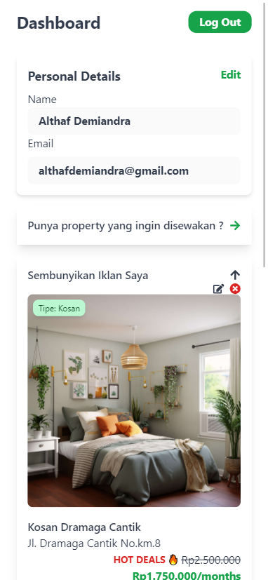
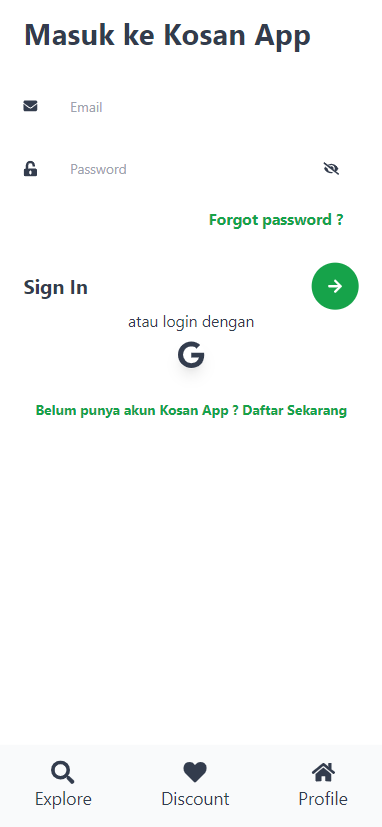
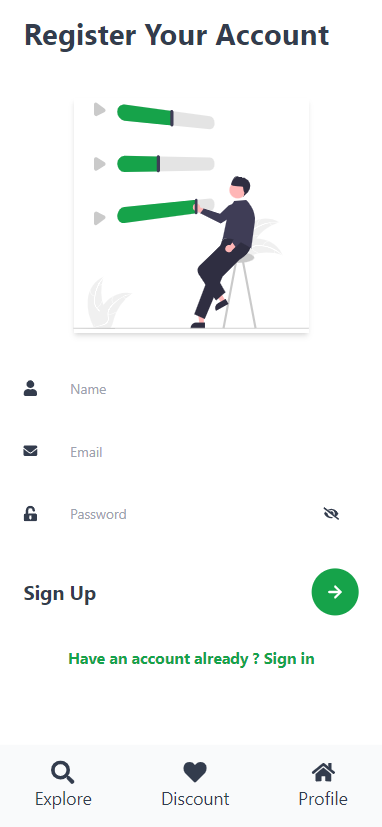
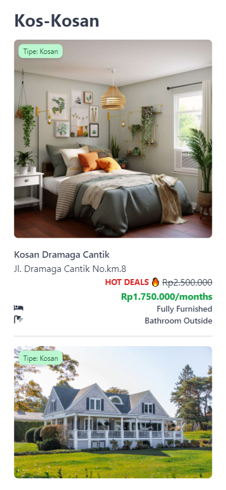
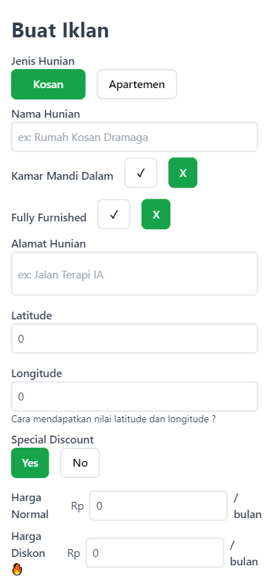

# Overview Kosan App

Fully functioned and interactive Fullstack Web Application to start your property business, heavily inspired by Mamikos. This is my first big fullstack application building from scratch. You can create an account with email or google account also see, create, update, and delete listing. Try it out!

Deployed Website: [https://kosan-app.netlify.app/](https://kosan-app.netlify.app/)

## How to install

Install the node_modules first

`npm install`

## Features

- Mobile First Design
- Explore Page
  - Latest Listings
  - Routing to Type Page
  - Routing to Login/Create Listing Page
- Sort by Type Page (Apartement/Kosan)
- Discount Page
- Login/Register/Logout with Email and Google OAauth
- Forgot Password
- Create, Read, Update, Delete to each Listing Item with Authentication to each account
- Single Listing Page
  - Carousel (max 6 picture)
  - Pinpoint Location with Maps
  - Property Facility
  - Best Deal Prices if available

## Screenshot

### Home / Explore

### Dashboard

### Login

### Register

### Sort by Type

### Create Listing

## The Process

### Built With

- React JS
- React Router
- Redux
- React Leaflet
- Swiper JS
- Tailwind CSS
- Firebase, Firestore, Firebase Authentication, Firebase Storage

### What I Learned

Learned a lot about tailwind since i ditched daisyUI and fully created my component one by one. Learned a lot about Firebase 9 and everything inside of it (Firestore, Storage, Authentication, upload Image handling). Finally my first project with Redux! it took a while to implement but i can see why people on the industry using this. It makes the application scalable

## Continued Development

None
